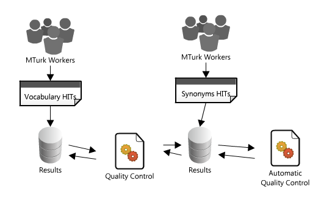
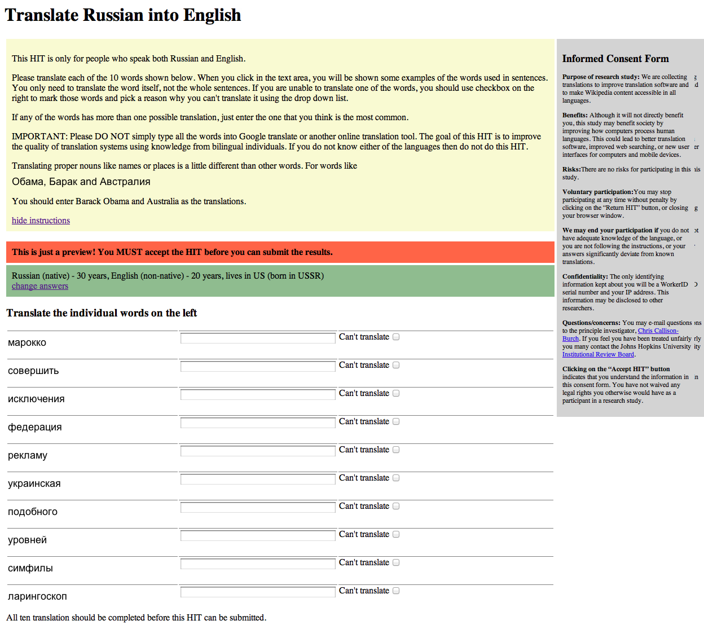
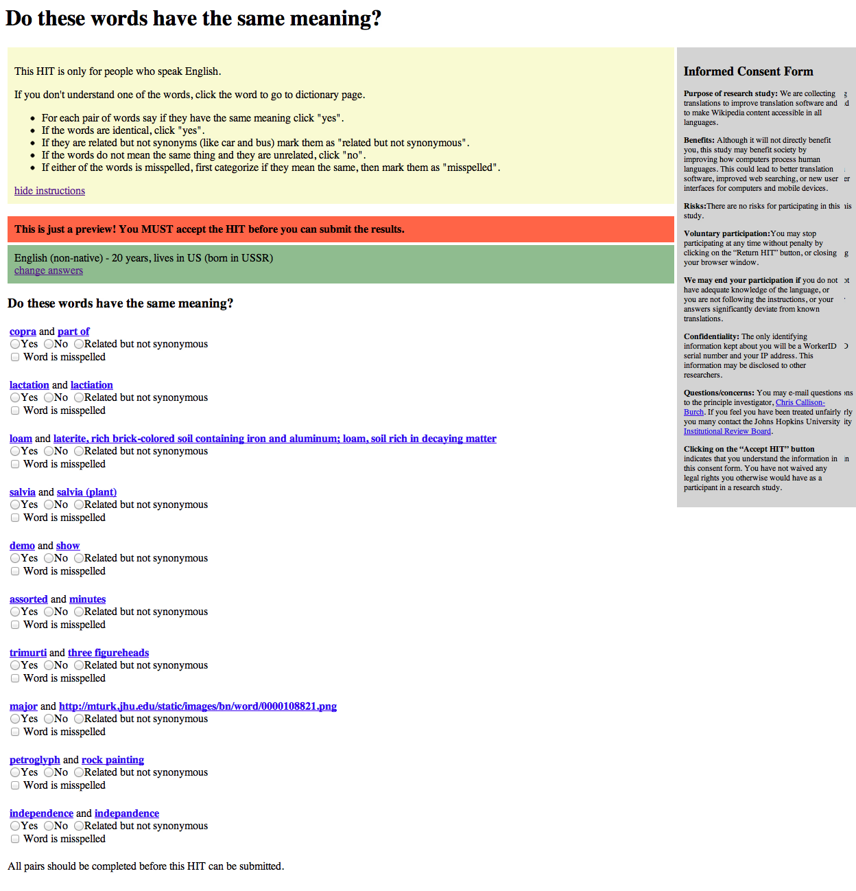
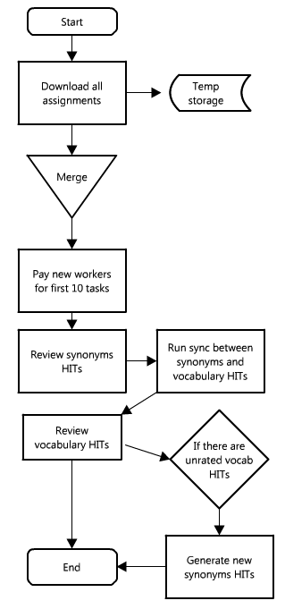

#Technical Report 

##OVERVIEW
This technical report documents experiment of collecting vocabularies of 100+ languages based on Wikipedia articles and translating them to English using Amazon Mechanical Turk crowd-sourcing platform.

As part of the experiment we compiled list of 100+ most used languages on Wikipedia (based on statistics such as number of articles per language). For each language we used historical pageviews data to narrow down the list of 1000 most popular articles for each language.

By crawling content of those most popular Wikipedia pages, we collected list of words sorted by frequency of words use in top 1000 articles.

Each of the collected vocabularies was trimmed to 10,000 most frequent words per language. Those vocabularies served as base for building foreign language - English dictionaries using crowd-sourced translation on Amazon Mechanical Turk platform.

As part of translation process we used multistep pipeline where words were translated 10 at a time to English. Out of 10 words, 8 words were based on compiled vocabularies and 2 words were controls (with known translations to English). In quality control step, we asked workers to decide if pair of words are synonyms or not, thus confirming if translation of controls from step 1 were correct. Workers have to judge 10 pairs at a time. Out of 10 pairs, 8 pairs come from step 1 (e.g. translation of foreign word that comes from worker vs. translation of a foreign word that we know for control) and 2 pairs come from prebuilt corpus of english synonyms and non-synonyms.

In this report we will describe details of collecting corpora for this experiment, as well as details on run of the experiments, statistics on workers who participated in experiment and instructions how to use software that was built for this experiment.

### Languages

We used following sources to compile sorted list of languages based on number of articles:

### Data Sources

* [List of Wikipedias] (http://meta.wikimedia.org/wiki/List_of_Wikipedias)

* [List of Wikipedias by language group] (http://meta.wikimedia.org/wiki/List_of_Wikipedias_by_language_group)

* [List of Wikipedias by speakers per article] (http://meta.wikimedia.org/wiki/List_of_Wikipedias_by_speakers_per_article)

We selected all languages with 10,000+ articles, and some of the languages with 1,000+ articles.

List of languages selected for the experiment:

>> Table – Selected Languages
>> select * from languages order by id asc;

##PROCESS

###Building vocabularies using Wikipedia

#### Overview
As a result of Wikipedia pipeline we generated two data files per language:
Vocabulary – list of words in foreign language and one to three sentences where these word occurs (per word).
Dictionary – list of foreign words, their translation to English and one to three sentences where these words occurs (per word).

As prerequisite for generation of vocabulary and dictionary files, we trained tokenizer for each language.

As input to this pipeline we used three pre-generated data files:

List of 100+ most used languages (see complete list above)

List of 1000 most popular articles per language in Wikipedia (generated somewhere in 2011??)

List of Wikipedia language links e.g. pairs foreign language article – English article that were connected (usually it means that both articles cover the same subject in two different languages)

#### Vocabulary generation process
This process was run for each foreign language:

Load list of names of 1000 most popular articles

Download content of those articles and strip it to text (no markup)

Run training for NLTK Punkt tokenizer for sentence splitting.

For each article, split it into sentences, then words. Compile vocabularies with words and their frequencies and up to three context sentences.

Clip vocabularies to 10,000 words only.

For dictionaries, we used pregenerated list of language links.
To build dictionaries we filtered language links pairs (e.g. foreign article – English article) to narrow list of  articles names being single word.
Then we filtered list so that English article names were and English word (based on NLTK WordNet vocabulary)
Generated list of pairs  foreign article name (single word) – English article name (single word) is essentially foreign –English dictionary (some subset of it).
Later, up to three context sentences were attached to each foreign word in dictionary based on content of article from Wikipedia with this word title.

#### Issues
Due to some issues with parsing and processing some of the languages (codepages/Unicode issues, etc), only subset of originally planned languages made it into main experiment.
(from 120+ languages, ~20 languages failed to process, leaving us with ~100 languages for main experiment)

>> Table – List of processed languages for the experiment
>> select a.prefix, a.vocab, b.dict from
(select prefix, count(*) as vocab from languages l, vocabulary v where l.id=v.language_id group by prefix ) a,
(select prefix, count(*) as dict from languages l, dictionary d where l.id=d.language_id group by prefix) b
where a.prefix=b.prefix order by a.prefix asc;

###Running HITs
####Overview
####HITs design and process

* Database diagram

####Design of controls

#####Data sources
* WordNet/Brown corpus-synonyms/non-synonyms
* WordNet filters (synonyms and nonsynonyms tables for QC) from Brown corpus

####HITs UI
User interface of both vocabulary and synonyms HITs includes common elements such as instructions for the task, consent form/notification, language survey and task area.

#####Vocabulary HIT

#####Synonyms HIT

	
####Quality of work
* quality of work on every stage (vocab and syn tasks)
* design of quality control
* problematic issues with low volume languages
* entities (biology terms)
* interlanguage links
* proper nouns in vocabularies

####Fraud detection
* (and other possible techniques)
* fraud distribution on map

####Throughput in different stages….
####(workers feedback??? Emails)

##RESULTS
###dictionaries x languages
###couple of examples of records in 3 languages
###report per language=
###number of words, number of words translated,  quality of translations, # of turkers, list of source countries of workers, ###(averages self reported stats from survey)

##SOFTWARE
###Inventory of software

To run the experiment we developed a series of command line scripts and web/database app.

All source code can be found in:
 
+ [https://github.com/kachok/wikilanguages-pipeline](https://github.com/kachok/wikilanguages-pipeline)

+ [https://github.com/kachok/wikilanguages](https://github.com/kachok/wikilanguages)

+ [https://github.com/kachok/hitman](https://github.com/kachok/hitman)

__Wikilanguage__ library allows to easily manipulate languages metadata (e.g. language names, groups, prefixes/codes, wikipedia stats for languages, directionality of script, etc)

__Wikilanguages pipeline__ scripts are used to crawl wikipedia and pre-build data such as vocabularies with words usage context (context sentences), foreign language- English dictionaries to use in experiment.

__Hitman__ scripts and web app allows to take vocabulary data prepared in pipeline scripts and load it into database for experiment, create tasks in Mechanical Turk and server HITs from external web server, as well  as capture produced result data and analyze it.

Following libraries were used:

+ [https://github.com/boto/boto](https://github.com/boto/boto)
+ [https://github.com/longouyang/mmturkey](https://github.com/longouyang/mmturkey)
+ [https://github.com/callison-burch/wikipydia](https://github.com/callison-burch/wikipydia)
+ [https://github.com/callison-burch/wpTextExtractor](https://github.com/callison-burch/wpTextExtractor)

###System requirements
* Mac OS X Lion Server (Mac Mini Server) - other Mac OSX or Linux/Windows setup is possible with modification
* Python 2.7+ (additional libraries needed to be installed like boto, BeautifulSoup, etc)
* PostgreSQL database 10.4 (with psycopg python adapter)
* Apache HTTP Web Server + Bottle.py (lightweight Bottle.py web framework can run as stand alone or on other web server)

###Server configuration
Everything was run on a single server accessible over Internet on port 80 - HTTP and 22 - SSH (Optional, for maintenance and running scripts remotely)

Here is full instruction how to prep Mac OS X Lion server (Mac Mini) to run everything - http://www.evernote.com/shard/s12/sh/c24572e7-585b-4084-ad14-22a1f9fe3145/2981a0ca64fb2333594bf239f4dcd707

### Initialization of the system

Prep data inputs.

Create new database from /backend/db/mturk.sql

Run following scripts from /backend/src in this order

	load_data_to_db.py
		populates langugages table in database
		loads data from input files in wikilanguages-pipeline format (python pickles) into database to vocabulary and dictionary tables respectively

    prepare_images_files.py
		generates images descriptor files for all vocabulary and dictionary items

	java  -Djava.awt.headless=true generateimages sentences.txt segments.txt images
	#java  -Djava.awt.headless=true generateimages test_sentences.txt test_segments.txt ../test_images
	#java  -Djava.awt.headless=true generateimages pilot_sentences.txt pilot_segments.txt ../pilot_images
		renders PNG files
		10MB of images per 1000 words+sentences

	obama4australia.py
		generates images for Barack Obama and Australia in all languages

	#java  -Djava.awt.headless=true Str2ImgObama support_sentences.txt support_sequence.txt ../pilot_images/support

	generate_voc_hits.py
		creates hittypes in MTurk and populates hittypes table in database
		generates batches of vocabulary HITs in database based on vocabulary data
		populates hits table and voc_hits_data tables in database

	add_voc_hits_to_mturk.py
		generates HITs in MTurk and reference them to batches of words in database
		creates HITs in MTurk for every HIT in datbase with empty mturk_hit_id column
		updates hits table with non-empty mturk_hit_id value

	generate_synonyms_table.py
		generates list of synonyms to be used in Synonyms HIT as controls

	generate_non_synonyms_table.py
		generates list of non-synonyms to be used in Synonyms HIT as controls

### Running the experiment

To run HITs on MTurk

 From /hitman/process/src folder run following commands:

    #downloads all HITs from MTurk
    python multi_test.py

    #updates database based on downloaded HITs
    python buffer_update.py

    #pays for first 10 tasks to turkers
    python pay_for_first10_tasks.py

    #runs sync between synonyms and vocabulary HITs
    psql -h localhost -d mturk -f syn_voc_link.sql

    #runs review of vocabulary HITs
    python review_vocabulary_hits.py
